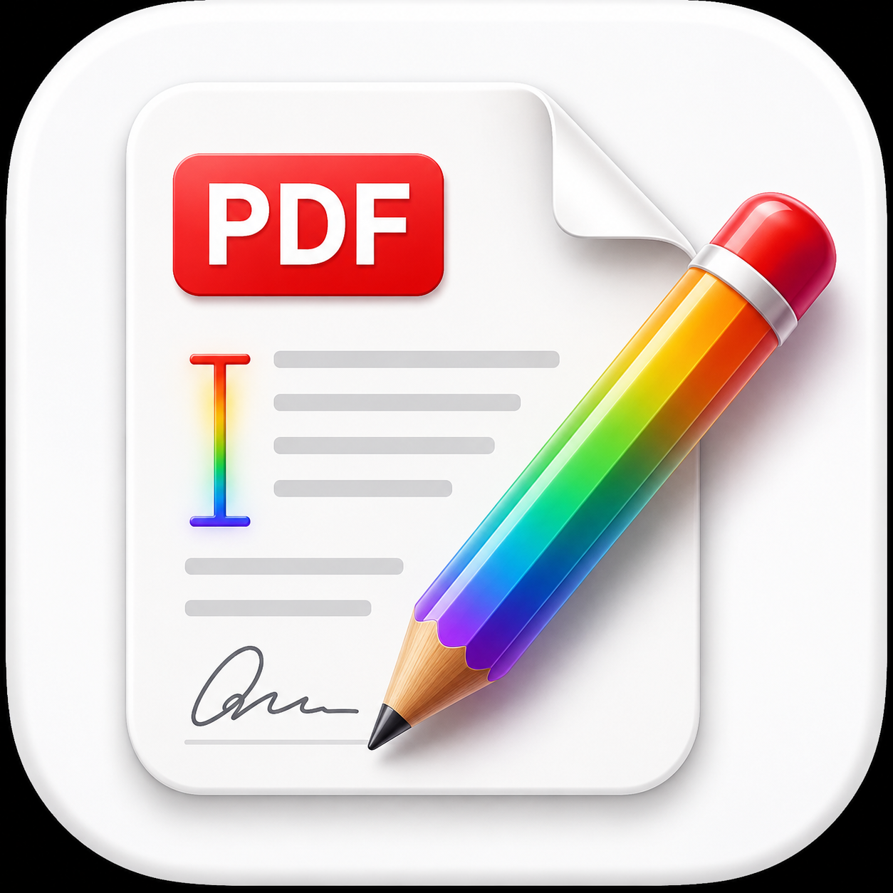

<p align="center">
  
</p>

# Free PDF Editor

**A native macOS PDF editor built on PDFKit.**  
Free PDF Editor focuses on the everyday editing workflow: open a PDF, detect text, visually replace text with any Mac font, highlight passages, add text boxes, place signatures, and export a final flattened copy.


## Download

The v0.0.1 distributable DMG is generated locally at:

```text
dist/FreePDFEditor-v0.0.1.dmg
```

Open the DMG, drag **Free PDF Editor.app** to Applications, then launch it.

> The current build is ad-hoc signed for local distribution. For public release outside this machine, sign with an Apple Developer ID certificate and notarize the DMG.

## Core Features

| Area | What it does |
| --- | --- |
| PDF viewer | Native `PDFView` rendering, scrolling, page thumbnails, zoom, and reading modes |
| Text replacement | Click a PDF text line, edit the text, choose any installed Mac font, size, text color, and cover color |
| Annotation tools | Highlight, underline, strikeout, text box, comment, rectangle, ellipse, line, and stamp |
| Signature tools | Draw a reusable signature or import a PNG/JPEG/TIFF signature image, then place it on a PDF |
| Editing controls | Select, move, resize, and delete inserted annotations |
| Save/export | Save editable annotations or export a flattened visual copy |

## Keyboard Shortcuts

| Shortcut | Action |
| --- | --- |
| `Command + O` | Open PDF |
| `Command + S` | Save |
| `Command + Shift + S` | Save As |
| `Command + Left Arrow` | Previous page |
| `Command + Right Arrow` | Next page |
| `Command + =` | Zoom in |
| `Command + -` | Zoom out |
| `Command + 0` | Actual size |
| `Command + Option + S` | Toggle page thumbnails |
| `Command + Option + I` | Toggle inspector |
| `Command + 1` ... `Command + 9` | Switch between core editing tools |
| `Delete` | Delete selected annotation |

## Text Replacement Model

PDFs are final-layout documents, not Word-style editable files. Free PDF Editor uses a practical PDFKit editing layer:

1. Detect text and its page bounds with PDFKit.
2. Show the detected text in the inspector.
3. Cover the original text area with a chosen cover color.
4. Add replacement text using Core Text-compatible macOS fonts.
5. Save as editable annotations or export a flattened visual PDF.

This is ideal for forms, certificates, invoices, simple contracts, and white-background PDFs. It is **not** a secure redaction engine. If you need legal/forensic redaction, use a dedicated redaction workflow that removes underlying content.

## Screens

The app uses a desktop editor layout:

- Left sidebar: page thumbnails
- Center canvas: native PDFKit viewer and editing surface
- Top toolbar: file, page, tools, zoom, reading mode
- Right inspector: text style, replacement editor, annotation settings, signature manager, file actions

## Build From Source

Requirements:

- macOS 14 or later
- Xcode 15.3 or later
- Swift 5.10 or later

Build and run:

```bash
./script/build_and_run.sh
```

Verify the app launches as a foreground `.app` bundle:

```bash
./script/build_and_run.sh --verify
```

Create the v0.0.1 DMG:

```bash
./script/package_dmg.sh
```

## Project Structure

```text
Sources/FreePDFEditor/
├── App/                    # SwiftUI app entrypoint and menu commands
├── Models/                 # Tool, reading mode, replacement, signature models
├── Services/               # PDF editor state and PDF annotation helpers
├── Stores/                 # Signature persistence
├── Views/                  # Editor, PDFKit bridge, inspector, sidebar, signature UI
└── Support/                # App metadata

script/
├── build_and_run.sh        # Build, bundle, sign, run, verify
└── package_dmg.sh          # Release build and DMG creation
```

## Verification Status

The current v0.0.1 build was verified with:

```bash
swift build
./script/build_and_run.sh --verify
./script/package_dmg.sh
codesign --verify --deep --strict --verbose=2 "dist/Free PDF Editor.app"
hdiutil verify dist/FreePDFEditor-v0.0.1.dmg
```

## Roadmap

- Word-level selection and smaller span replacement
- Better background color sampling around detected text
- Page rotation, deletion, and reordering
- OCR-assisted text replacement for scanned PDFs
- True secure redaction as a separate workflow
- Developer ID signing and notarized public DMG releases

## License

See [LICENSE](LICENSE).
